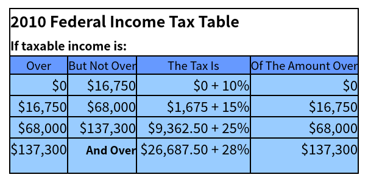

# Step3: Flow Control and Bool Expressions
1. if语句
2. 分块和exit(1);
3. 布尔表达式
## 小任务
1. 这个程序将根据年收入和免税额计算纳税人所欠的税额。
2. 提示用户输入他/她的年收入。
3. 如果年收入低于9350美元，欠税金额为零。输出零，退出程序。
4. 提示用户指定申报状态，可以是(1)单身，(2)已婚，共同申报，或(3)已婚，单独申报
如果用户选择选项(1)或选项(3)，将申报人的数量设为1，标准扣除额为5700。
如果用户选择选项(2)，将标准扣除额设为11400，并提示用户输入孩子的数量。在这种情况下，将申报人的数量设置为2+子女数量。
提示：switch-case语句实现选择选项/
5. 申报人数量乘以3650，再加上标准扣除额，以确定总扣除额。
6. 使用下表计算税后收入，即年收入减去扣除额。

7. 在屏幕上显示所欠税款的数额。
例子：假设两人已婚，有3个孩子，年薪75000美元。年收入为75000美元。申报人的数量是2+3=5。标准扣除额为11400。因此，总扣除额为11400 + 5 * 3650 = 29650。应税收入是75000-29650=45350。在表格中，我们看到这个数额超过了16750，但不超过68000，所以税款是1675+15%*(45350-16750)=5965。程序应该输出5965。